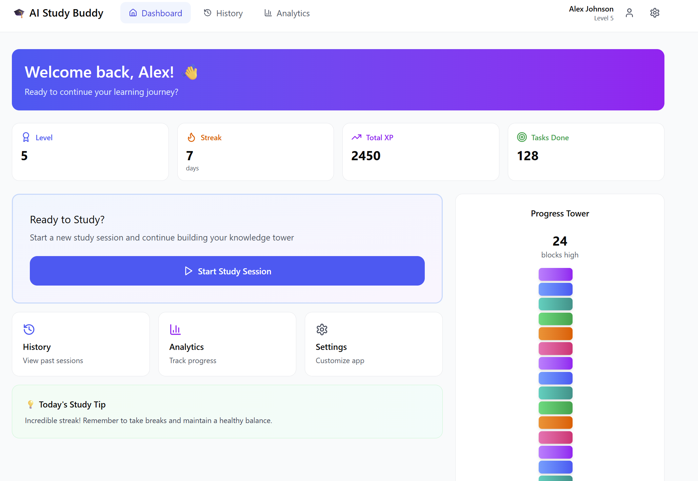
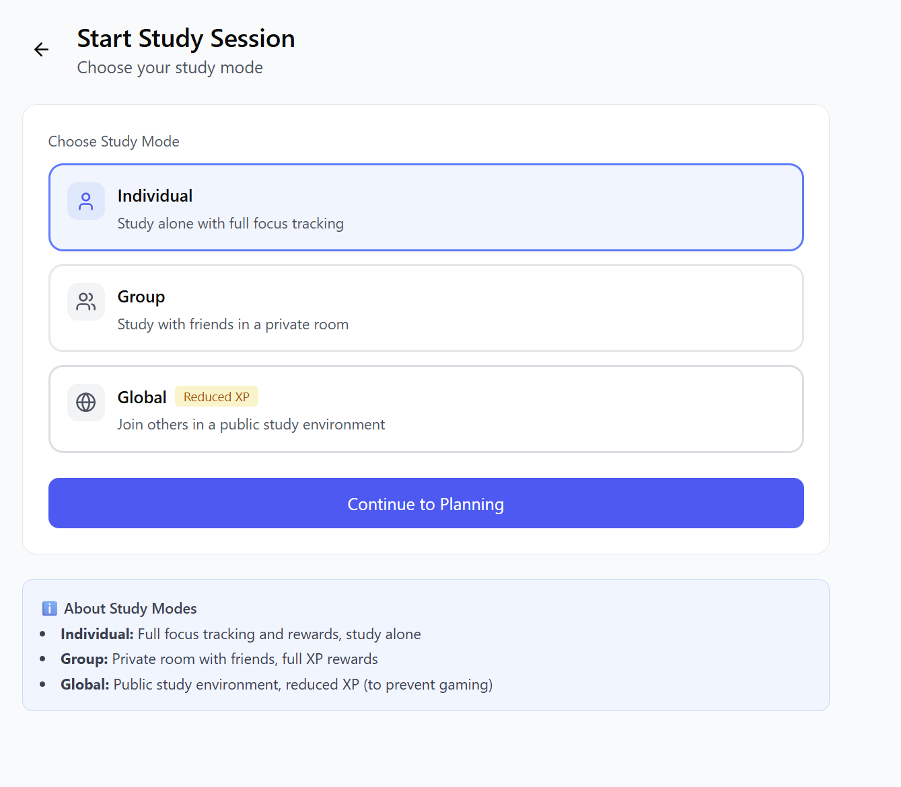
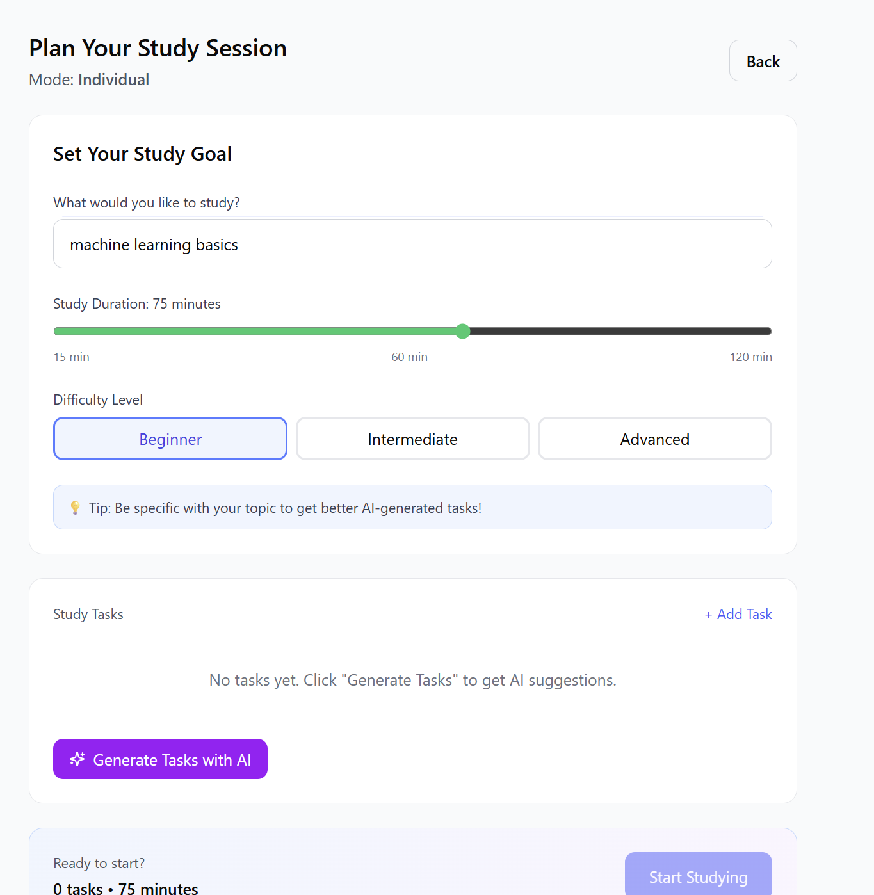
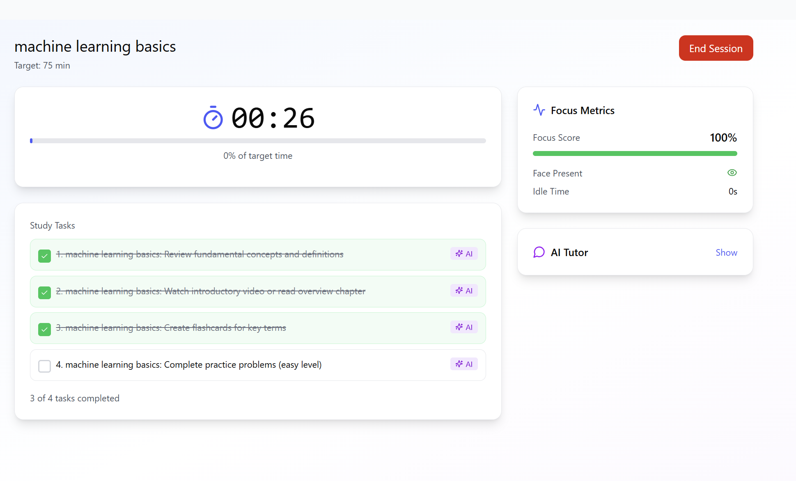
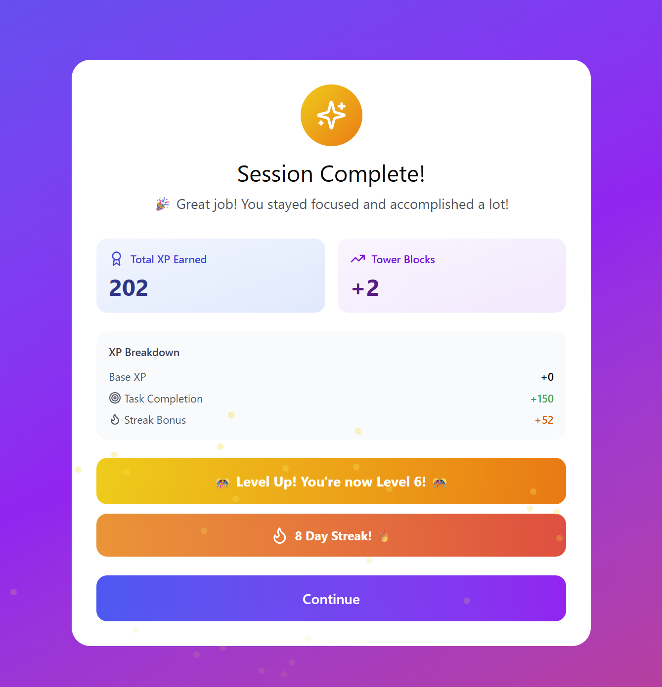
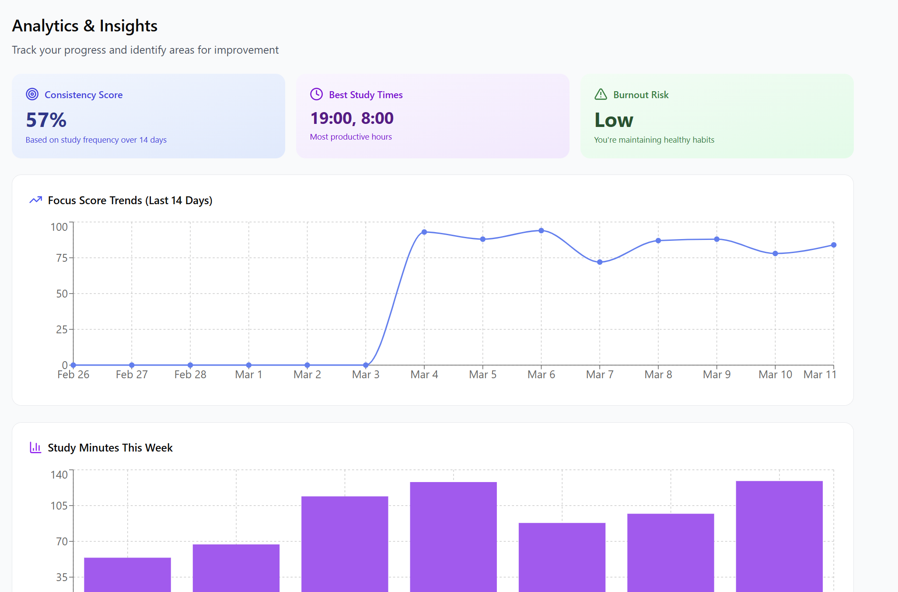
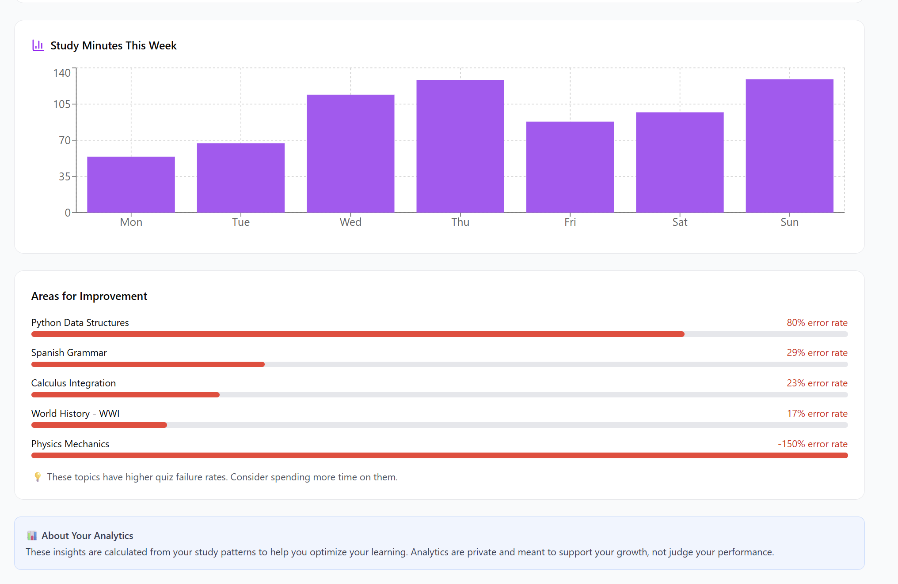
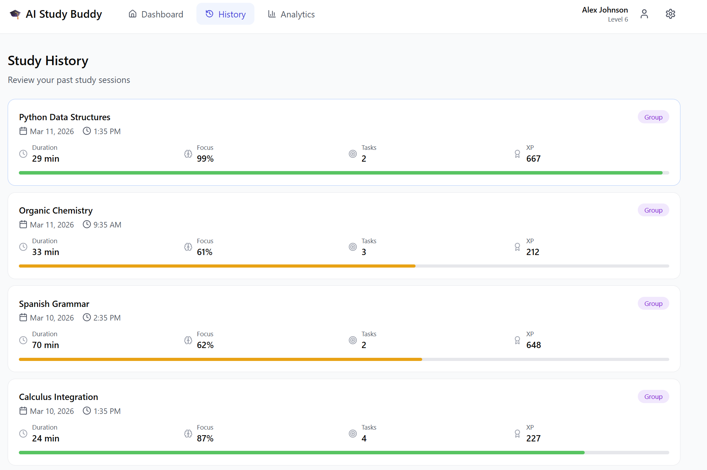

# AI Study Buddy

AI Study Buddy is a **privacy-first AI learning assistant** that transforms study sessions into **structured, focused, and validated learning experiences**.

Instead of scattered notes and distracting group chats, AI Study Buddy provides an environment where students can **plan, focus, validate learning, and track progress**.

---

## Live Project

Frontend  
https://ai-study-buddy-kappa-flame.vercel.app

Backend API  
https://ai-study-buddy-lobd.onrender.com/docs

---

# Features

### 🧠 AI Study Planner

Breaks learning goals into structured tasks using AI.

### 🎯 Focus Monitoring

Detects focus levels during study sessions.

### 📚 Quiz Validation

Ensures learning is validated through quizzes.

### 🏆 Gamification

Earn XP, build streaks, and grow your progress tower.

### 📊 Analytics Dashboard

Track study time, focus score, and quiz accuracy.

### 🤖 AI Mentor

Receive alerts when attention drops.

---

# How It Works

Goal → AI Planner → Study Session → Quiz Validation → XP + Streak → Analytics

---

# Tech Stack

### Frontend
- Next.js (App Router)
- TailwindCSS

### Backend
- FastAPI
- Python
- Groq (Llama3)

### Database
- Supabase (PostgreSQL)

### AI / Vision
- MediaPipe (Focus Detection)

### Deployment
- Vercel (Frontend)
- Render (Backend)

---

# Project Structure

# Project Structure

ai-study-buddy
│
├── backend
│   ├── api
│   ├── agents
│   ├── services
│   ├── repositories
│   ├── schemas
│   └── main.py
│
├── frontend
│   ├── app
│   ├── components
│   ├── lib
│
├── README.md
└── .gitignore

---

# Screenshots

### Dashboard

AI-powered study dashboard with XP, streaks, and progress tower.

---

### Study Session

Focus tracking, tasks, and quizzes.

---

### Analytics

Visual insights on study performance.

---

# Run Locally

RUN LOCALLY

Clone the repository

git clone https://github.com/SumithaDevHub/ai-study-buddy.git
cd ai-study-buddy

---

## BACKEND SETUP

Create virtual environment

python -m venv study_buddy_venv1

Activate environment (Windows)

study_buddy_venv1\Scripts\activate

Install dependencies

pip install -r requirements.txt

Start backend server

uvicorn main:app --reload

Backend runs at

http://localhost:8000

Swagger API docs

http://localhost:8000/docs

---

## FRONTEND SETUP

Go to frontend folder

cd frontend

Install dependencies

npm install

Start development server

npm run dev

Frontend runs at

http://localhost:3000

---

## ENVIRONMENT VARIABLES

Create a .env file inside the backend folder.

Example:

SUPABASE_URL=your_supabase_url
SUPABASE_KEY=your_supabase_key
JWT_SECRET=your_secret
GROQ_API_KEY=your_groq_key

## Frontend Environment Variables

Create a `.env.local` file inside the `frontend` folder.

Example:

NEXT_PUBLIC_API_URL=https://ai-study-buddy-lobd.onrender.com

---

## AUTHORS

Sandhiya T
sandhiya.cs22@bitsathy.ac.in

Sumitha S
asr.sumitha@gmail.com

---

## License

This project is for educational and portfolio purposes.

## FUTURE IMPROVEMENTS

- Study rooms
- Shared study sessions
- Advanced analytics
- Collaboration features
